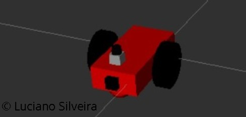
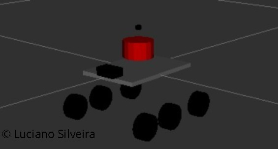
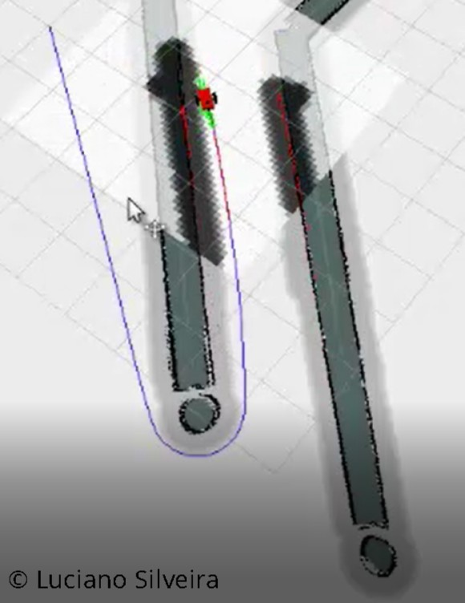
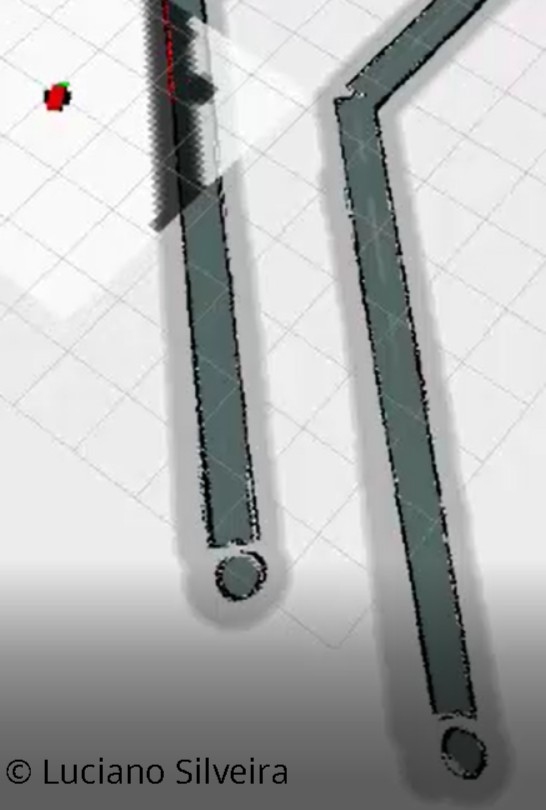
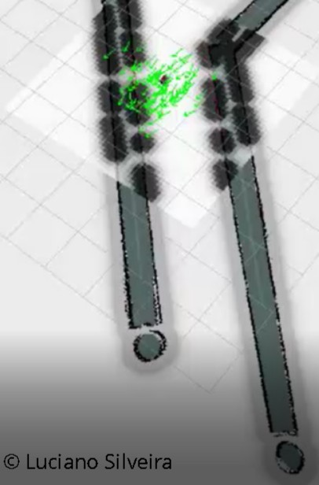
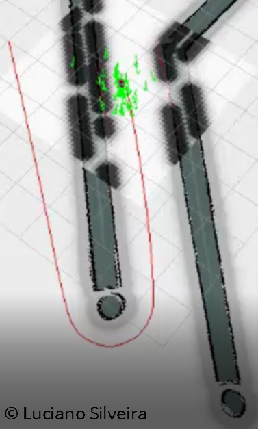
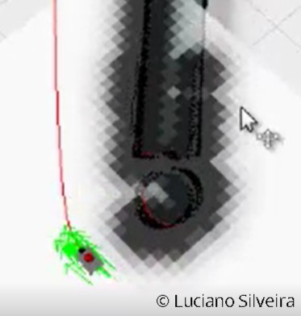
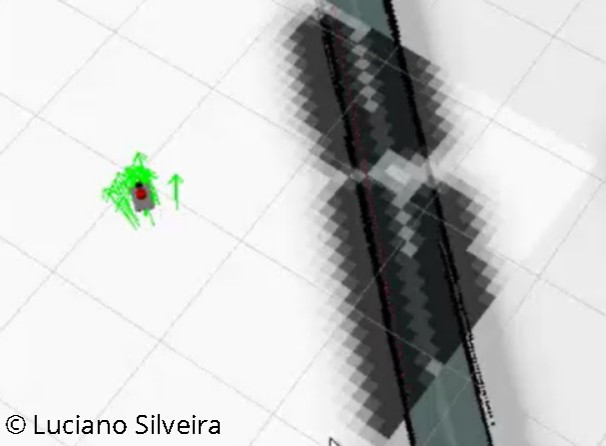

# RoboND-WhereAmI-Project-P6

Robot localization project.

## Abstract

Robot localization consists of determining where a mobile robot is located in its environment. Localization is one of the most fundamental competencies required by any autonomous robot and is an essential for making decisions.

Based on standard ROS packages ([AMCL](http://wiki.ros.org/amcl) and the [Navigation Stack](http://wiki.ros.org/navigation/Tutorials/RobotSetup)), the objective is to accurately localize a mobile robot inside a provided map in the [Gazebo](http://gazebosim.org/) and [RViz](http://wiki.ros.org/rviz) simulation environments. 

## Introduction

Robot localization is the process of determining where a mobile robot is located with respect to its environment. Localization is one of the most fundamental competencies required by an autonomous robot as the knowledge of the robot's own location is an essential precursor to making decisions about future actions.

This project explores the usage of standard ROS packages such as AMCL and Move Base to accurately localize and command a mobile robot inside a provided map in the Gazebo simulator.

Based on the specification, initially the `udacity_bot` was created using the SDF language definition; an XML file format used to describe all the elements in a simulation environment.



The `udacity_bot` includes two wheels plus a castor one using a standard differential drive. It has a laser scanner (Lidar) and a camera.

The localization is solved using the AMCL package, while the navigation through the move base stack, where you can define a goal position for your robot in the map; and the robot will navigate to that goal position.

All the steps for accuracy localization were followed and then a second bot called `ls_bot` was created changing its sensors and exploring with a different robot structure.



The `ls_bot` is an extension from the [rocker-bogie project](https://github.com/SyrianSpock/rover). Several changes were needed to make to compile using the ROS Kinetic Kame default infrastructure. The autonomous rover includes a GPS, camera, inertial sensors (IMU) and Lidar for navigation. The sensory information was added using the [Gazebo plugins reference](http://gazebosim.org/tutorials?tut=ros_gzplugins).

Each robot needed to be tuned separately. Initially parameters were shared but latter they needed its own for the AMCL and navigation stack. Both packages are separated:

 * [udacity_bot](ros/src/udacity_bot)
 * [ls_bot](ros/src/ls_bot)

## Background

Navigation is one of the most challenging competencies required of a mobile robot. Success in navigation requires success at the following:

 * `perception`: interpret robot's sensors to extract meaningful data
 * `localization`: determine its position within the environment
 * `cognition`: decide how to act to achieve its goals
 * `motion control`: the robot must modulate its actuators to achieve the desired goals.

Localization has received the greatest research attention during the past decades and is still being an active research area; significant advances have been made.

Integrating the usage of ROS packages Adaptive Monte Carlo Localization (AMCL) and the Navigation Stack, allowed the robots to navigate and localize in a particular environment or map.

The validation for the correct navigation was used the [Rviz](http://wiki.ros.org/rviz) utility tracking the robot's current location and displaying the generated "Robot Pose", Global and Local costmaps and the associated paths to the desired goal. 

Initially all tuning was done for the `udacity_bot` and when everything worked the same parameters were tested on the `ls_bot` rover. As it didn't work as expected; parameters were changed to get a reasonable navigation on both rovers.

### AMCL

The MCL (Monte Carlo Localization) algorithm uses a series of particles on a map to represent its location. Each particle represents a potential location and orientation of the rover on the map. Initially the particles are set randomly; during motion the particles will move in accordance with the rover sensory information. On each cycle, a probability is set for each particle and only those with higher probability will survive in the next iteration. A new set of particles are generated based on those probabilities. Eventually over time only those particles that correspond to the correct position and orientation will survive.

The AMCL (Adaptative MCL) package is an extension of the MCL algorithm. It uses a sampling technique to adapt the number of particles on each iteration based on how uncertain the robot is on its current location. On uncertain situations a larger number of particles are generated; when the rover has better confidence of its location; the particles will be narrowed down. 

The amcl package has a lot of parameters to select from. Different sets of parameters contribute to different aspects of the algorithm. Broadly speaking, they can be categorized into:

 * overall filter
 * laser
 * odometry
 
#### Overall Filter

 * `min_particles` and `max_particles` - As AMCL dynamically adjusts its particles for every iteration, it expects a range of the number of particles as an input. On both robots the parameters were set 30 to 150. Initially values were much higher and little by little the values were decreased.
 * `initial_pose` discarded on this project.
 * `update_min` as AML relies on incoming laser scans. Upon receiving a scan, it checks the values for `update_min_a` and `update_min_d` and compares to how far the robot has moved. Based on this comparison it decides whether or not to perform a filter update or to discard the scan data. Discarding data could result in poorer localization results, and too many frequent filter updates for a fast moving robot could also cause computational problems. Values were set 0.1 and 0.3 respectively.

#### Laser

There are two different types of models to consider under this - the `likelihood_field` and the `beam`. Each of these models defines how the laser rangefinder sensor estimates the obstacles in relation to the robot. The selection was `likelihood_field`.

 * `laser_max_beams` set to 60.

#### Odometry

 * `odom_model_type` was tested with `diff-corrected` and `diff`, both options can be used and no significant changes were detected, `diff-corrected` was selected for `ls_bot` and `diff` for `udacity_bot`.
 * `odom_alphas` (1 through 4) define how much noise is expected from the robot's movements/motions as it navigates inside the map, a value of 0.05 was selected.

#### Other parameters

 * `gui_publish_rate` was lowered to 4Hz to improve performance.
 * `transform_tolerance` time with which to post-date the transform that is published; incresed its value from 0.1 to 0.3. 
 * `kld_err` is the maximum error between the true distribution and the estimated distribution changed; its default value 0.01 was changed to 0.05.
 
### Navigation Stack

The [move_base]((http://wiki.ros.org/move_base)) package help navigate the robot to the goal position by creating or calculating a path from the initial position to the goal, and the amcl package will localize the robot.

Move Base utilizes a costmap on top of the provided map. A costmap divides the map into a grid where a cell could represent free space or an obstacle. The `global costmap` is used to generate a long-term path for the robot, such as the path to the goal position from the robot's starting position.

The `local costmap` is used to generate a short-term path for the robot. For example, a path that attempts to align itself and the robot with the global path.

Parameters are centralized in the following files for `udacity_bot`:

 * [local_costmap_params.yaml](ros/src/udacity_bot/config/local_costmap_params.yaml)
 * [global_costmap_params.yaml](ros/src/udacity_bot/config/global_costmap_params.yaml)
 * [costmap_common_params.yaml](ros/src/udacity_bot/config/costmap_common_params.yaml)
 * [base_local_planner_params.yaml](ros/src/udacity_bot/config/base_local_planner_params.yaml)

and equivalent files on the package `ls_bot` ([config](ros/src/ls_bot/config/) folder).

#### move_base_params.yaml
 
Modifications done on the move_base parameters for [ls_bot](/ros/src/ls_bot/config/move_base_params.yaml) and [udacity_bot](/ros/src/udacity_bot/config/move_base_params.yaml):

All frequencies were lowered from the default values to get better performance for a small rover because it is not necessary to set a very high rate. Besides all the warnings detailed from the Navigation stack were minimized.

 * `controller_frequency` set to 4Hz
 * `planner_frequency` set to 4Hz.

Patience parameters were increased to be more tolerant to possible problems such as bottlenecks:

 * `controller_patience` set to 1Hz.
 * `planner_patience` set to 1Hz.

The `TrajectoryPlannerROS` base local planner was selected, the alternative [DWAPlannerROS](http://wiki.ros.org/dwa_local_planner) (Dynamic Window Approach) was tested too but the result were not satisfactory.

For the `global planner` the default selection was used: [NavfnROS](http://wiki.ros.org/navfn).

#### costmap_common_params.yaml

 * `map_type`: `voxel` for `ls_bot` and `costmap` for `udacity_bot`.
 * `obstacle_range`: The default maximum distance from the robot at which an obstacle will be inserted into the cost map in meters. 2.5 for `ls_bot` and 4.0 for `udacity_bot`. 
 * `raytrace_range`: The default range in meters at which to raytrace out obstacles from the map using sensor data; 3.0. 
 * `transform_tolerance`: the default value was set higher, in general a value of 0.2 or 0.3 on both rovers.
 * `inflation_radius`: determines the minimum distance between the robot geometry and the obstacles; set a conservative value of 0.3.
 * `robot_radius`: the distance a circular robot should be clear of the obstacle; set a conservative value of 0.30.
 * `footprint`: as the robot is not circular [ [0.2, 0.2], [-0.2, 0.2], [-0.2, -0.2], [0.2, -0.2] ]
 * `sim_time`: The amount of time to forward-simulate trajectories in seconds; increased little by little up to 2.0.
 * `xy_goal_tolerance`: The tolerance in meters for the controller in the x & y distance when achieving a goal; 0.1.
 * `yaw_goal_tolerance`: The tolerance in radians for the controller in yaw/rotation when achieving its goal; increased to 0.3.

#### global_costmap_params.yaml and local_costmap_params.yaml

Lowered all frequency parameters:

 * `update_frequency` set to 10Hz.
 * `publish_frequency` set to 5Hz.

Lowered the size of the global map to 15x15 and local map to 5x5.

Increased the map resolution to improve performance:

 * `resolution` increased to 0.1.
 
Played with different plugin layers such as StaticLayer, VoxelLayer and InflationLayer.

#### base_local_planner_params.yaml

 * `acc_lim_x`: The x acceleration limit of the robot was decreased to 1.0meters/sec^2.
 * `acc_lim_theta`: the The y acceleration limit of the robot, used the default of 2.5meters/sec^2 for `ls_bot` and 1.0meters/sec^2 for `udacity_bot`.
 * `min_vel_theta`: The minimum rotational velocity allowed for the base set to -0.9radians/sec.
 * `max_vel_theta`: The maximum rotational velocity allowed for the base set to 0.9radians/sec.
 * `max_vel_x`: The maximum forward velocity allowed for the base set to 0.6meters/sec.
 * `min_vel_x`: The minimum forward velocity allowed for the base set to 0.1 meters/sec.
 * `escape_vel`: Speed used for driving during escapes lowered to -0.3meters/sec to react faster.
  
Forward Simulation Parameters

 * `sim_time`: Increased the amount of time to forward-simulate trajectories to 1.7 seconds.
 * `sim_granularity`: The step size to take between points on a given trajectory increased to 0.1m.
 * `vx_samples`: Inreased the number of samples to use when exploring the x velocity space to 6m.
 * `vtheta_samples`: Decreased the number of samples to use when exploring the theta velocity to 10.

Trajectory scoring parameters

 * `meter_scoring`: Changed to True to assume that goal_distance and path_distance are expressed in units of meters.
 * `occdist_scale`: Increased the weighting for how much the controller should attempt to avoid obstacles from 0.01 to 0.1.
 * `pdist_scale`: Increased the weighting for how much the controller should stay close to the path it was given from 0.6 to 0.9.
 * `gdist_scale`: Increased the weighting for how much the controller should attempt to reach its local goal from 0.8 to 0.9. When using higher values the rover got stuck several times when trying to transition a corner.

Oscillation Prevention Parameters

 * `yaw_goal_tolerance`: Experimented with different values to control the rover rotation when achieving its goal, from 0.15 to 3.14.

## Results
 
To execute the samples you need three terminals. For the `udacity_bot` rover execute the following:

```sh
$ roslaunch udacity_bot udacity_world.launch
$ roslaunch udacity_bot amcl.launch
$ rosrun udacity_bot navigation_goal
```

To execute the sample on `ls_bot`:

```sh
$ roslaunch ls_bot sandbox_world.launch
$ roslaunch ls_bot amcl.launch
$ rosrun udacity_bot navigation_goal
```

### Udacity_bot

Once the `udacity_world.launch` and `amcl.launch` files are run the rover is set on its initial position:


Notice the Global and Local costmaps are overlayed. After setting a Goal location using the provided `navigation_goal` node the local and global path planning is set and the rovers starts moving to the desired final location:



During the movement of the robot to its goal location the `PoseArray` cloud is narrowed, the final result once arrived to its destination:



### ls_bot

Simiarly to the previous example the starting point is:



The Global, Local costmaps and paths once a destination is set:



Zooming in while performing a curve:



Close to its goal location:



For more detail check the following videos:

 * [udacity bot using diff](data/ubot02_diff.mp4)
 * [udacity bot using diff-corrected](data/ubot01_diff_corrected.mp4)
 * [lsbot using diff-corrected](data/lsbot01_diff-corrected.mp4)

## Discussion

Comparing the results between the rovers, notice that the AMCL localization worked better on `udacity_bot` than `ls_bot`. On both rovers several parameters were changed on purpose and other because of different physical conditions. The objective was to get a better understanding on how to construct robot definitions, how nodes interact and parameter tuning works.

`ls_bot` is faster and has more acceleration so it seems that it makes it more difficult for the AMCL node to get an accurate localization.

All parameters related to frequency such as `controller_frequency` needed to be reduced so it works on the Virtual Machine provided. On the other hand the `transform_tolerance` needed to be increased from the default values to remove different kind of warnings.

The Global and Local map were reduced its size and resolution.

The robot footprint was slightly increased and an inflation radius was set to avoid collistions during navigation.

The `pdist_scale` and `gdist_scale` resulted very important parameters to tune to control how close to the path the rover should move. In relation, it was important to relate to `occdist_scale` to weight how much the controller should attempt to avoid obstacles and `obstacle_range` in conjunction with `raytrace_range` to decide when an obstacle is inserted to the cost map.

Increasing the `sim_time` parameters to forward-simulate trajectories got a overall better result.

To achieve a reasonable solution it was needed to decrease the number of `min_particles` and `max_particles` when tuning the AMCL node, and set the related `update_min_a` and `update_min_d` to decide whether to discard incoming laser scans. Using the default values proved to be too computationally extensive and poorer localization results.

## Considerations

### Segmentation Fault

The Gazebo Skid Steering Drive was tested on `ls_bot` but the following error appear, so the default Differential Drive was used.
```
[ WARN] [1549136459.896152317, 1517.347000000]: GazeboRosSkidSteerDrive Plugin (ns = //) missing <covariance_x>, defaults to 0.000100
[ WARN] [1549136459.896289921, 1517.347000000]: GazeboRosSkidSteerDrive Plugin (ns = //) missing <covariance_y>, defaults to 0.000100
[ WARN] [1549136459.896345824, 1517.347000000]: GazeboRosSkidSteerDrive Plugin (ns = //) missing <covariance_yaw>, defaults to 0.010000
Segmentation fault (core dumped)
```

### Rover Frame Information

All frame information was validated using [rqt_tf_tree](http://wiki.ros.org/rqt_tf_tree) command:

```sh
$ rosrun rqt_tf_tree rqt_tf_tree
```

### Dynamic Reconfigure

For tuning the AMCL, Move_base and planners parameters; it was fundamental the usage of the [rqt_reconfigure](http://wiki.ros.org/rqt_reconfigure) and [roswtf](http://wiki.ros.org/roswtf) ROS utilities.

```sh
$ rosrun rqt_reconfigure rqt_reconfigure
$ roswtf
```

## Conclusion / Future Work

The objective to localize and navigate both robots in a known map was achieved.

The project was run on the Virtual Machine provided. To minimize the usage of resources it was decided to run the Gazebo `jackal_race` without a GUI and only use RViz for validation through sensory information. In relation to that an as detailed on the discussion section, several changes were needed on the frequency, resolution of parameters so it is possible to prototype on the virtual machine.

Overall it was quite challenging the tuning of all the needed parameters to get a reasonable navigation on the provided simulation. The interaction between ROS nodes to get Navigation proved to be feasible.

In order to get a better localization, `ls_bot` added the usage of an IMU but wasn't enough or at least there was no improvement detected. Shaft encoders, GPS could be added and fuse all this information (IMU, Shaft Encoders, Lidar Odometry, GPS) to get a better location estimate. A new node such as [robot_localization](http://wiki.ros.org/robot_localization) could be used using standard Kalman Filter approach.

In this way, fusing sensory data could help to solve the kidnapped robot problem where an autonomous robot in operation is carried to an arbitrary location so it lost its current location. As AMCL bases its data on laser scans and laser maps, extra work should be done to work with other sensor data. For example correlate a position and orientation with a visual beacon or use other sensors.

Anyway, AMCL node seems to be a reasonable localization solution for an indoor industry domain where a known map is set.

### Links:
 * [Initial repository](https://github.com/udacity/RoboND-Localization-Project)
 * [SDF format](http://sdformat.org/spec?ver=1.6&elem=sdf)
 * [Move Base](http://wiki.ros.org/move_base)
 * [costmap_2d](http://wiki.ros.org/costmap_2d)
 * [Navigation Stack Config](http://wiki.ros.org/navigation/Tutorials/RobotSetup)
 * [AMCL Parameters](http://wiki.ros.org/amcl#Parameters)
 * [This repository](https://github.com/ladrians/RoboND-WhereAmI-Project-P6)
 * [Project Rubric](https://review.udacity.com/#!/rubrics/1365/view)
 * [Mobile Robot Localization](http://www.cs.cmu.edu/~rasc/Download/AMRobots5.pdf)
 * [Gazebo plugins](http://gazebosim.org/tutorials?tut=ros_gzplugins)